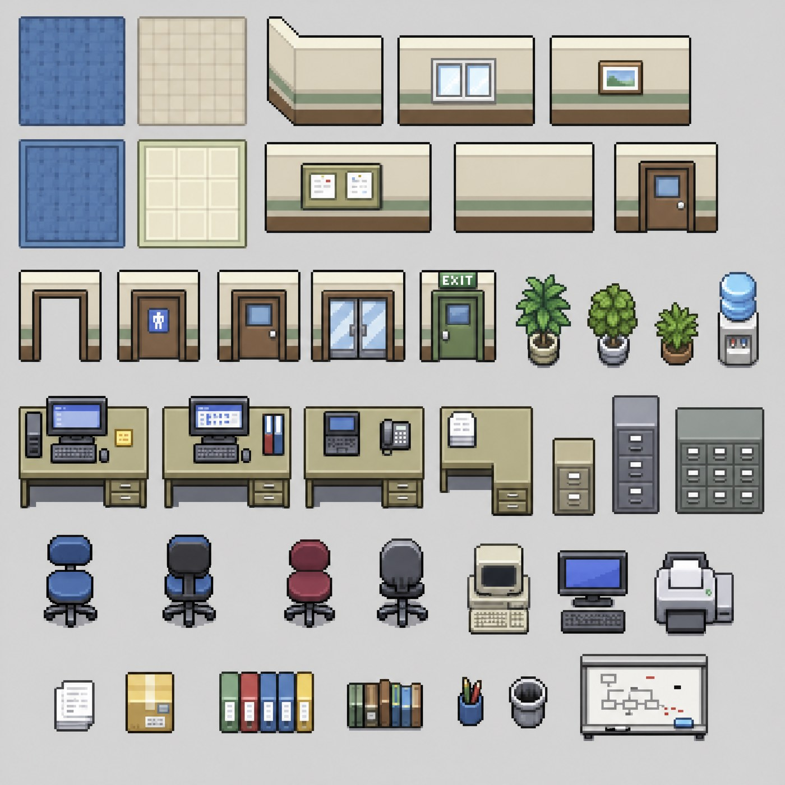
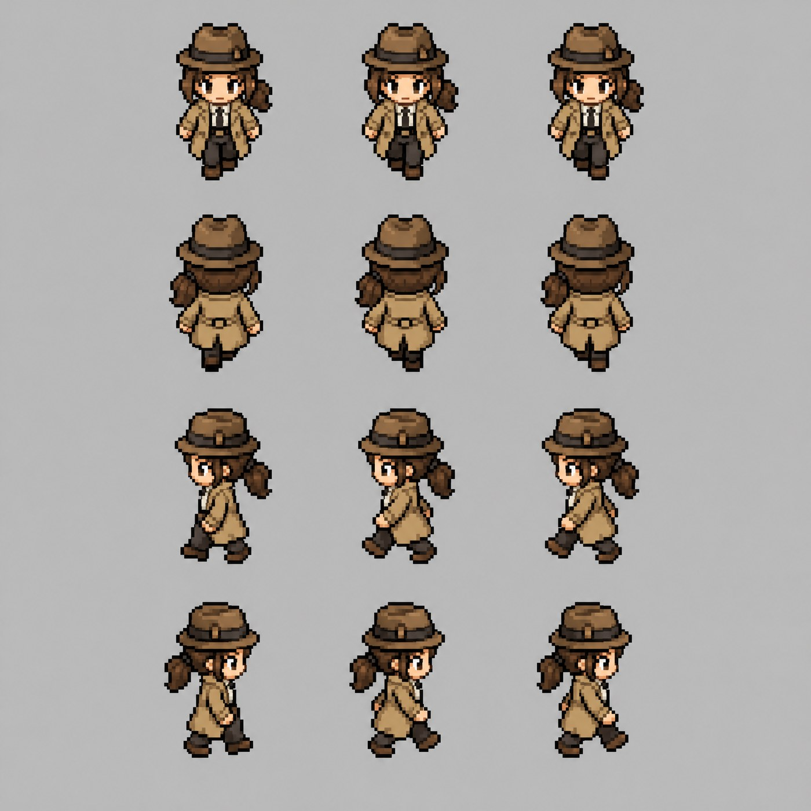
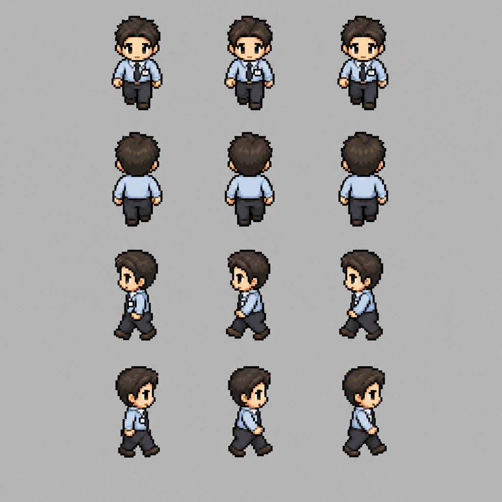
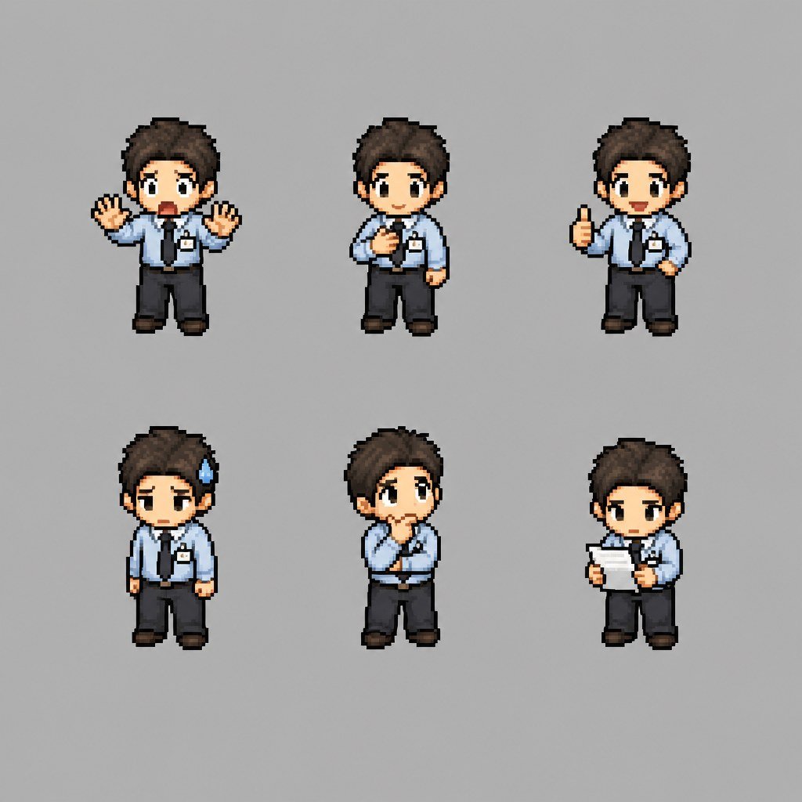
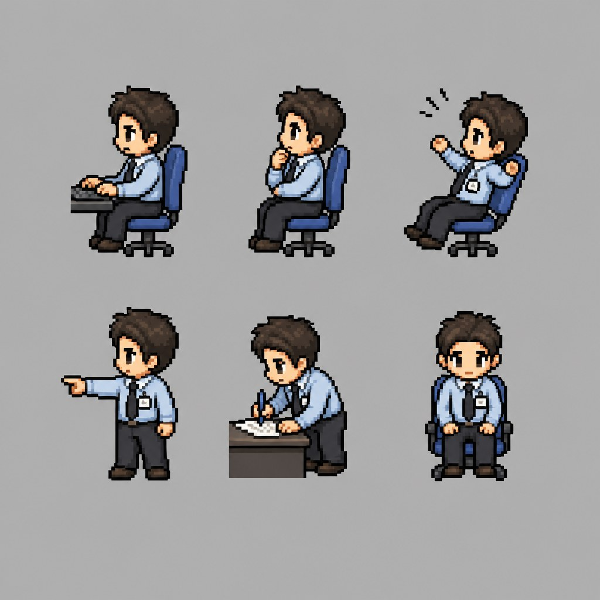
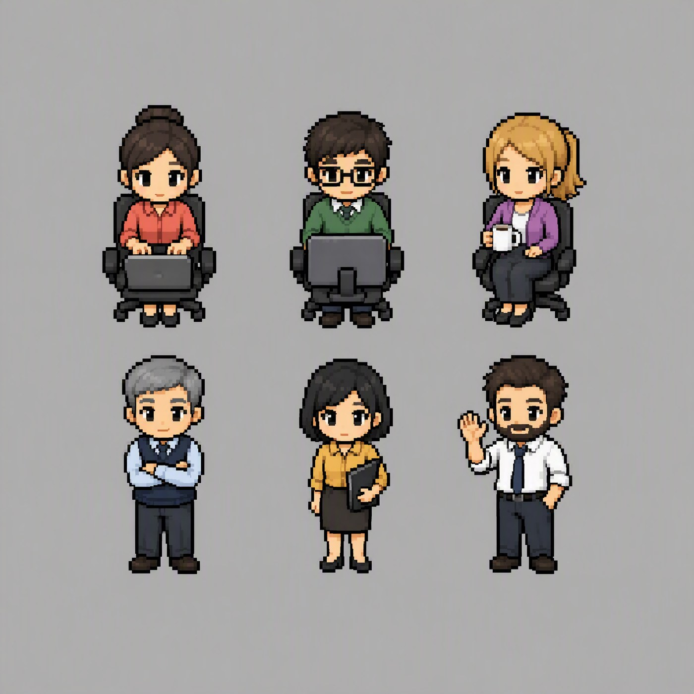
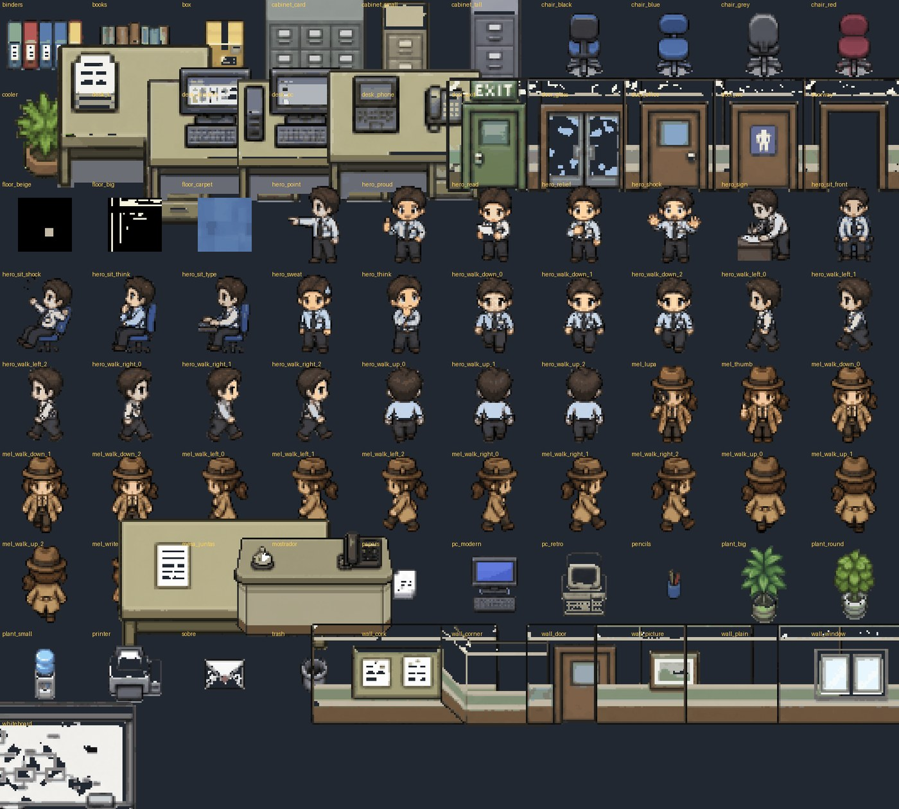
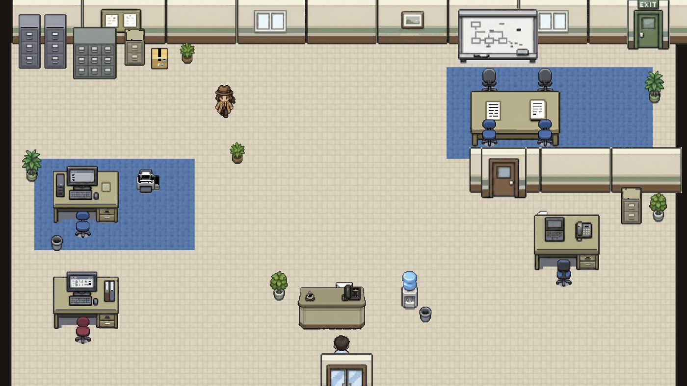

# Riesgos en el uso de la IA — Un martes en la oficina

### Micro-curso interactivo en pixel art · 10 minutos · HTML autocontenido

> Una oficina en pixel art estilo Game Boy Advance donde cada zona es un riesgo real del uso de IA en el trabajo: fuga de datos, cifras sin verificar, datos personales con reglas encima, documentos con instrucciones ocultas y el visto bueno automático. El recorrido es el de cualquier martes: primero aprendes el concepto con un visual didáctico, luego lo pones a prueba en un caso donde la opción tentadora existe a propósito — y equivocarse no castiga: una detective de soporte llega, lo arregla contigo y deja la regla escrita en su libreta. Cierra con evaluación de cinco preguntas y un veredicto que depende de tu criterio, no de tu suerte. Todo vive en un solo archivo HTML: sprites generados con IA y reducidos por código a pixel art real de retícula de 32, mundo dibujado en canvas, música chiptune generada con IA e incrustada en el propio archivo — cero dependencias externas, listo para funcionar sin conexión dentro de un LMS.

**🔗 Enlaces**
- ▶️ **Curso en vivo:** https://mauricio-agapito-herrera.github.io/CURSO-IA-PIXEL-ART/
- 💼 **LinkedIn:** https://www.linkedin.com/in/mauricio-agapito-herrera
- 🎨 **Behance:** https://www.behance.net/mauriciagapito

---

## 🎨 Case study

---

## 🧩 Dentro del repositorio

- **`index.html`** — el curso completo: mundo, estaciones, evaluación, audio. Un solo archivo, sin dependencias.
- **`assets_pixel/`** — los 88 sprites finales en su resolución real (tiles de 32 px) con su manifiesto de tamaños: personajes, muebles, pisos y muros ya recortados, cuantizados y listos para reutilizarse.
- **`img/`** — el case study del proceso, en orden: de las hojas generadas con IA a la oficina armada por código.

---

## 💼 ¿Te sirve este curso?

**¿Lo quieres en tu LMS?** Te lo adapto a cualquier formato —SCORM, xAPI, HTML5 o el que use tu plataforma— **sin costo**. Y si tienes un proyecto en mente o te interesa un curso a la medida, escríbeme y lo platicamos.

---

Diseño instruccional y desarrollo · Mauricio Agapito Herrera
